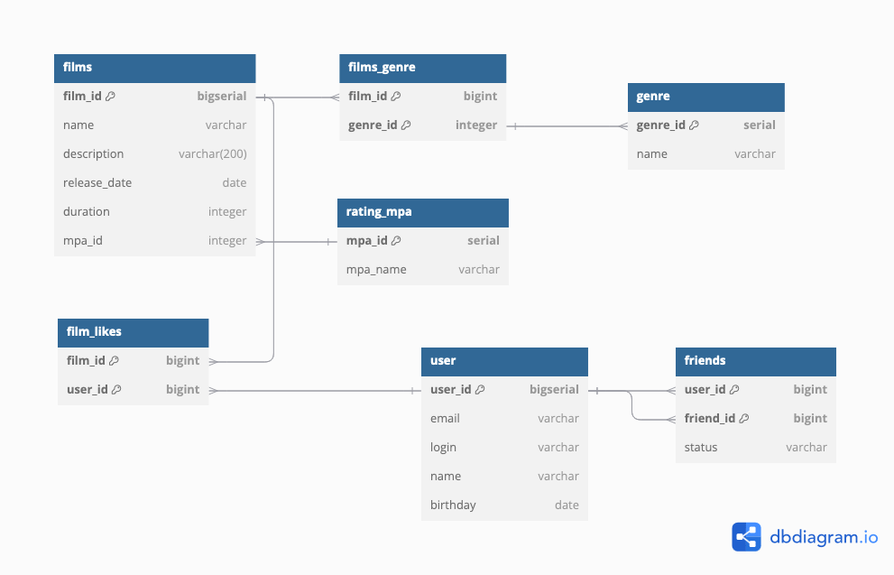

# java-filmorate

Схема базы данных


 `film` - таблица содержит информацию о фильме
`user` - таблица содержит информацию о пользователе
`friends` - таблица содержит информацию о статусе дружбы между двумя пользователями
`films_genre` - содержит информацию о жанрах конкретного фильма
`genre` - содержит информацию о жанрах
`rating` - содержит информацию о рейтинге
`film_likes` - содержит информацию о пользователях, которым понравился фильм

# Примеры запросов к БД

Получение списка пользователей
```sql
SELECT * FROM user;
```
Добавление нового пользователя
```sql
INSERT INTO user (email, login, name, birthday)
VALUES ('mail@mail.ru', 'user', 'Иванов', '2000-01-01');
```
Получение списка друзей пользователя с id 1
```sql
SELECT u.login
FROM user as u
WHERE u.id = (SELECT friend_id FROM friends
              WHERE user_id = 1 AND status = 'Added');
```
Получение списка фильмов
```sql
SELECT * FROM film;
```
Удаление фильма с id 1
```sql
DELETE FROM film WHERE id = 1;
```
Получение списка 10 самых залайканных фильма
```sql
SELECT name
FROM film
WHERE id IN (SELECT film_id
                  FROM film_likes
                  GROUP BY film_id
                  ORDER BY COUNT(user_id) desc
                   LIMIT 10);
```